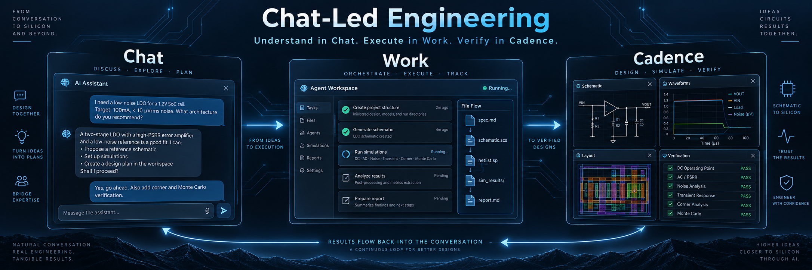
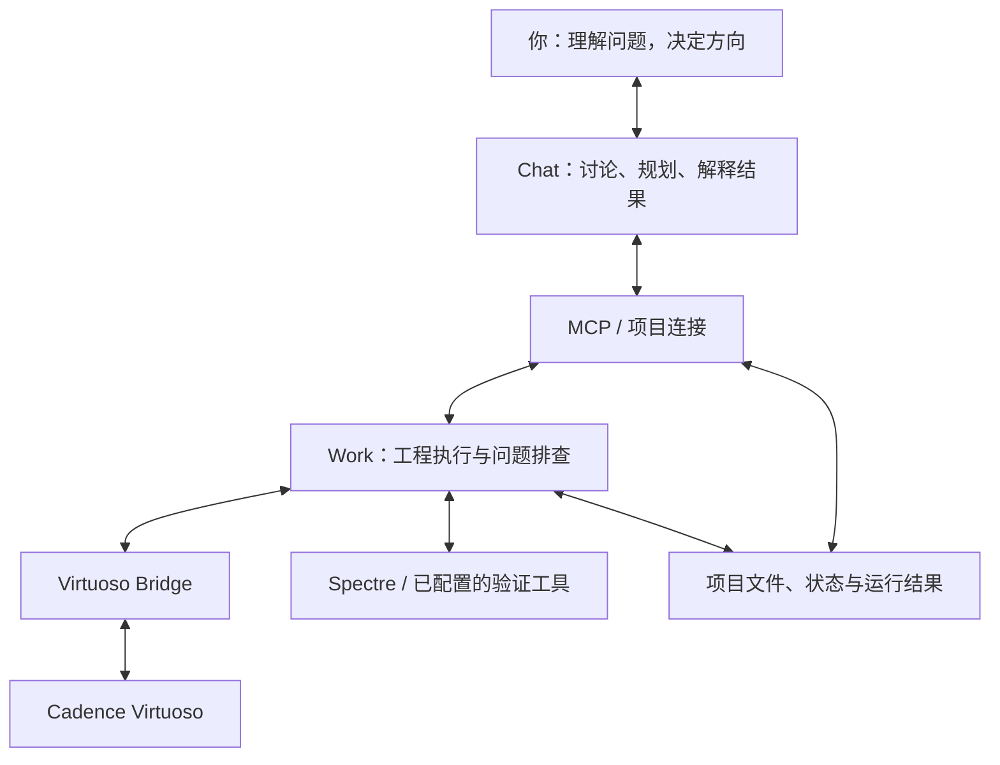

# Chat-Led IC Engineering

  

**让对话走进模拟 IC 设计。**

在 Chat 中理解问题，在 Work 中推进工程，让真实结果回到下一轮讨论。

Chat-Led Engineering 是一套面向模拟 IC 设计的人机协作方法。它把 Chat、Work、MCP 与 Cadence 连接起来，让电路设计不止发生在软件操作中，也发生在你与 AI 持续的讨论、判断和验证中。

你可以带着一个还不完整的电路想法开始，也可以带着一个迟迟无法解释的问题继续。我们希望你得到的，不只是一份设计文件，而是一个能够推进项目、也帮助你理解项目的协作过程。

**把想法做出来，也把为什么想明白。**

> **项目进展：** 方法来自一个已完成的本地非公开模拟 IC 项目。当前先分享协作方法与设计依据；后续将另选开源电路项目实际运行，再补充可公开检查的案例、工程文件和结果。

## 为什么开始这个项目

在自己的模拟 IC 项目中，我发现，AI 带来的价值不只在于完成工具操作。

同样重要的，是在 Chat 中不断追问、讨论和梳理：我真正想实现的是什么？为什么当前结果与预期不同？Work 遇到的卡点，究竟需要继续执行，还是需要换一种方式理解问题？

有时，继续推进项目所需要的不是更多操作，而是一次更清楚的讨论。在多轮对话中，我能逐步理解设计，也能重新审视执行端遇到的困难，再带着新的判断回到工程里。

这让我开始关心一个问题：

> **如果对话能够帮助人形成更清楚的设计判断，执行端又能够把判断落实到专业工具中，能否把两者组织成一种连续的模拟 IC 设计方式？**

Chat-Led Engineering 就从这里开始。

它不是为了证明 Chat 比 Work 更强，也不是为了让人退出设计过程。它希望把理解与执行连接起来，让人不必在“自己完成所有操作”和“只等待 AI 给出结果”之间二选一。

## 理解、执行，再带着结果继续理解

这套方法的中心不是一条自动运行到底的命令，而是一段可以持续推进的设计协作。

### 在 Chat 中，把想法变成值得执行的判断

一个项目刚开始时，用户未必已经知道所有指标和约束，也不一定能把问题写成完整的任务说明。我们希望保留一个允许追问、解释和改变想法的空间，而不是要求用户一开始就把一切交代清楚。

在这里，你可以讨论电路用途、方案选择和设计取舍，也可以先弄懂某个问题，再决定是否修改设计。Chat 的职责，是与你共同澄清这些意图，把它们整理为当前目标、需要遵守的约束，以及下一步值得验证的问题。

**对话不只是任务入口，也是人形成理解、作出决定的地方。**

### 在 Work 中，让讨论真正改变工程

形成明确判断之后，Work 承接需要落实的工作：在已配置的环境与授权范围内，读取或修改工程、调用工具、运行检查，并整理实际产生的文件与结果。

这里分开的是职责，而不是把 Work 当作不需要分析的命令执行器。执行过程中仍然需要判断和排查；我们希望约定范围内的工作能够连续推进，而涉及目标变化或重要设计取舍时，再回到讨论中决定。

用户不需要逐条转述所有操作，但仍然能够决定项目要往哪里走。

### 遇到卡点时，回到问题，而不只是继续尝试

例如，当一次仿真结果偏离预期时，下一步不一定是继续修改参数。也可能需要先检查：测试条件是否对应最初的目标？已经做过的检查排除了什么？当前解释还缺少哪一项证据？

在这套方法中，执行端把设计状态、已做尝试和运行结果带回来，Chat 再与你一起重新组织问题。新的讨论应当形成下一轮能够执行和检查的工作，而不只是另一段解释。

这是对协作方式的说明，不是尚未公开的案例记录。它表达的是本项目最重视的一种体验：**执行让讨论有依据，讨论让执行有方向。**

### 让项目能够接着做，而不是每次重新开始

长期协作不能只依赖一次聊天保留了多少内容。当前采用哪个版本、哪些结论已经接受、哪些尝试失败过，以及下一步准备做什么，都需要进入可以重新读取的项目记录。

这些记录用于帮助讨论端和执行端接续工作。保存上下文的目的，不是让用户维护更多文书，而是让下一轮对话能够从“我们已经知道什么”开始，而不是反复解释整个项目。

## 为什么采用这样的分工

OpenAI Academy 的官方指南把 Chat 与 Work 描述为互补的工作方式：Chat 适合讨论想法和聚焦的问题，Work 适合收集上下文、完成多个步骤并交付可审阅的成果。[^chat-work]

本项目借鉴的是这种职责分工，而不是把它当成模型能力的高低排序。对于模拟 IC 设计，我们选择让 Chat 保留面向人的讨论空间，让 Work 承接面向工程的执行任务，再以项目记录和实际结果连接两边。

OpenAI 的代理构建指南还介绍了 **Manager pattern**：由一个中心代理协调专门的执行代理，并将结果综合回统一交互。这为“保留统一讨论入口，同时调用专门执行能力”提供了架构参考。[^manager]

这里参考的是组织原则，不是声明本项目复刻了其 SDK 示例，也不是要求每个任务都经过同样复杂的分工。一个问题在当前讨论中就能解决时，没有必要额外制造交接。

Lenny’s Podcast 与 Tara Seshan 的访谈公开概要，则从产品角度讨论了另一种变化：当 AI 承担更多执行，人更需要判断方向。这启发我们把目标放在**有理解地参与设计**，而不是单纯减少人的参与次数。[^interview]

**这些资料解释了设计选择的依据；本项目能做到什么，仍要由实际工程过程和结果说明。**

## 从对话到 Cadence，两段连接各司其职

这套方法包含两段不同的连接：一段让 Chat 与工程执行端交换任务、文件和进度；另一段让执行端进入 Cadence 和已配置的仿真、验证环境。

下面展示的是职责关系，具体操作能力由实际接入的工具和权限决定。

**MCP / Plugin 解决接入问题。** OpenAI 的 Plugin Quickstart 展示了如何把 MCP server 暴露的工具接入 ChatGPT Work；Secure MCP Tunnel 则提供了连接私有或本地 MCP server 的路径，无需将该服务直接暴露到公网。[^plugins] [^tunnel]

MCP 本身不规定 Chat 与 Work 如何分工，也不会自动提供工程记忆或 Cadence 操作能力；工作流仍需由项目组织，具体能力仍需由工具实现。[^mcp]

**Virtuoso Bridge 解决专业工具操作问题。** 本项目依托 Arcadia-1 的 `virtuoso-bridge-lite`。上游提供 Agent 与 Cadence Virtuoso 的连接基础，包括原理图、版图、Maestro 和 Spectre 等接口。它是具体的工具桥接项目，与 MCP 协议处在不同层面。[^bridge]

把它们组合起来，才形成“讨论产生任务—工具产生结果—结果返回讨论”的过程。连接本身不会替我们完成设计判断，也不会让所有工程步骤自动变得可靠。

因此，我们把**解释与证据分开**：AI 可以提出假设，但接受设计结论时，应查看实际运行结果及其模型、条件与检查范围。执行了什么、验证了什么、哪些仍然未知，需要能够区分。

## 它为谁而做

我们首先希望服务于**有电路想法、但还不熟悉专业工具的人**，尤其是第一次尝试在 Cadence 中设计、仿真或检查电路的大学生。

对这些使用者，目标不只是完成一次操作，而是让设计与理解一起推进：知道当前在做什么，能够追问结果的含义，也能够参与下一步判断。我们希望降低的是进入工具和组织工程工作的门槛，而不是把电路知识与工程判断从设计中移除。

这个项目也面向**希望搭建自己 AI 工程工作流的开发者**。我们分享的不只是一个工具入口，而是把讨论、执行、项目上下文与结果复核组织起来的方式。开发者可以结合自己的模型、工具和工艺环境，检查哪些部分值得复用，哪些需要调整。

## 本项目的工作：把连接能力组织成设计体验

OpenAI 提供平台与接入能力，Virtuoso Bridge 提供专业软件的操作基础。Chat-Led Engineering 的工作，是把这些能力放进模拟 IC 的真实项目中，整理为一种可以理解、实施和继续完善的协作方法。

我们的设计重点，是让用户的意图成为工程任务，让执行结果成为下一轮判断的依据，并让一个项目能够跨越多次任务持续推进。这涉及讨论与执行的职责划分、任务边界、项目状态、结果复核，以及中断后的工作接续。

我们希望明确的是目标、权限与验收依据，而不是提前写死所有分析路线。常规工作应当能够推进，需要人作出判断的地方则应清楚地呈现出来。

**上游工具回答“Agent 怎样操作 Virtuoso”；本项目进一步探索“人怎样与这些能力一起，把模拟 IC 项目做下去”。**

## 来自实际项目，走向公开复现

这套方法已经用于一个完成于本地的非公开模拟 IC 项目，并在使用过程中形成了当前的协作思路。该项目不是开源项目，本仓库不包含其私有设计文件或具体结果。

接下来，我们将另选适合公开复现的开源电路项目，在实际运行之后补充案例。我们希望面向的设计路径包括：

**原理图 → 仿真与问题排查 → 设计迭代 → 版图 → DRC / LVS → 寄生提取与后仿真。**

实际展示到哪一步，由所选项目、工具和工艺环境，以及真正完成的工作决定。案例不仅要展示最后的电路，也要说明：最初要解决什么，遇到了什么问题，讨论如何影响下一步，以及什么结果支持了最终判断。

我们会分别看待三个问题：**工程是否完成、协作是否帮助人理解和推进项目、其他开发者是否能够复用。** 其中任何一项的进展，都不会自动被当作另外两项已经得到验证。

公开案例的目的，是让人看见这套方法怎样工作、在哪里仍然有阻力，并据此改进它，而不是预设 Chat–Work 必须在所有任务上优于其他方式。

## 了解与复用

当前仓库提供协作说明、工作模板和文档教学示例；完整工具接入、执行脚本与复现说明仍在整理和验证中。教学示例使用合成数据，不代表真实电路的验证结果。

可以从[协作架构](docs/architecture.md)了解各部分关系，通过[一轮任务示例](examples/task-to-evidence.md)查看任务与结果如何衔接，再阅读[实践经验](docs/lessons-learned.md)。[项目状态](templates/project-state.md)、[任务交接](templates/task-handoff.md)与[结果报告](templates/evidence-report.md)模板用于辅助这些工作，不是项目的全部。

实际运行需要具备相应工具访问权限的 ChatGPT / Work 环境、配置好的 MCP 与执行端，以及可用的 Cadence、适用 PDK 和任务所需的仿真或验证工具。具体接入能力应以所用工具版本和环境配置为准。

## Built on & References

### OpenAI：平台接入与工作方式

[Chat / Work 官方使用说明][chat-work]提供产品分工参考；[Plugin Quickstart][plugins]与[Secure MCP Tunnel][tunnel]提供工具及私有环境的接入参考；[A practical guide to building agents][manager]中的 Manager pattern 提供任务组织参考。

这些资料支持本项目的设计依据，不表示 OpenAI 对本项目实现或效果作出背书。

### Arcadia-1：Virtuoso 执行基础

[**Arcadia-1 / virtuoso-bridge-lite**][bridge] 是本项目使用的 Cadence 桥接上游。仓库列出的作者为 **Zhishuai Zhang、Xintian Li、Nan Sun、Lu Jie**。相关底层能力归属于上游项目，不作为 Chat-Led Engineering 独立实现的成果。[^bridge]

### Model Context Protocol：协议参考

[**MCP Architecture overview**][mcp] 用于说明 AI 应用、客户端与服务器之间的关系，以及协议与应用工作流的边界。

### 产品理念延伸阅读

[**Lenny’s Podcast：AI’s third era: the rise of persistent AI coworkers**][interview]，Tara Seshan，2026-08-30。这里引用其公开节目概要中的人机分工讨论，不将访谈作为本项目效果的证明。

---

**让更多人开始设计电路，也真正理解自己的设计。**

[chat-work]: https://academy.openai.com/public/clubs/work-users-ynjqu/resources/chatgpt-work-for-business-operations-teams-webinar-resource-guide-2026-08-26
[manager]: https://openai.com/business/guides-and-resources/a-practical-guide-to-building-ai-agents/
[plugins]: https://developers.openai.com/plugins/quickstart
[tunnel]: https://developers.openai.com/api/docs/guides/secure-mcp-tunnels
[mcp]: https://modelcontextprotocol.io/docs/learn/architecture
[bridge]: https://github.com/Arcadia-1/virtuoso-bridge-lite
[interview]: https://www.lennysnewsletter.com/p/ais-third-era-the-rise-of-persistent

[^chat-work]: OpenAI Academy, [ChatGPT Work for business operations teams: Webinar Resource Guide][chat-work]，章节 “When to use Chat and when to use Work”。
[^manager]: OpenAI, [A practical guide to building agents][manager]，章节 “Manager pattern”。
[^plugins]: OpenAI Developers, [Plugins — Quickstart][plugins]。
[^tunnel]: OpenAI Developers, [Secure MCP Tunnel][tunnel]。
[^mcp]: Model Context Protocol, [Architecture overview][mcp]，章节 “Scope” 与 “Participants”。
[^bridge]: Arcadia-1, [virtuoso-bridge-lite][bridge]，项目 README 与 Authors。
[^interview]: Lenny’s Podcast, [AI’s third era: the rise of persistent AI coworkers][interview]，2026-08-30，公开节目概要。

<!-- References checked: 2026-09-24. Public circuit results will be added only after actual execution. -->
